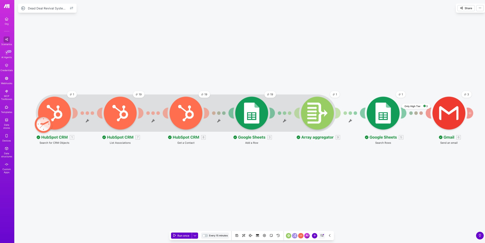
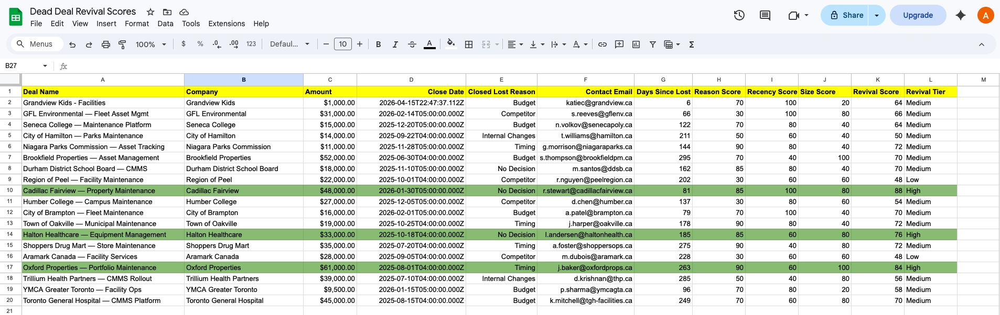
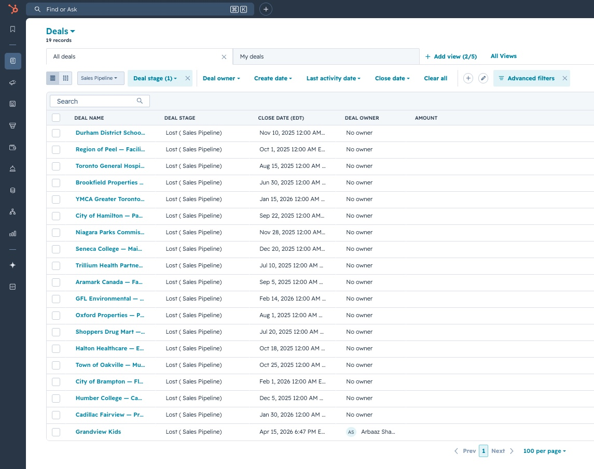
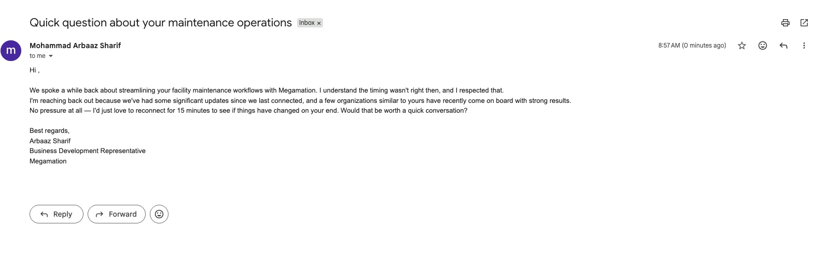
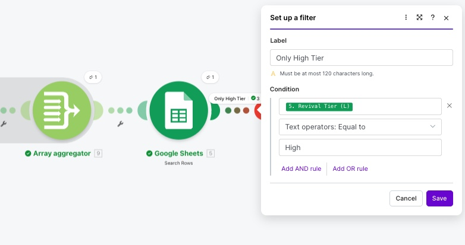

# Project 2 — Dead Deal Revival System

**An automated workflow that finds and re-engages high-potential closed-lost deals in HubSpot, built with Make.com, Google Sheets, and Gmail.**

---

## The Problem

Every sales CRM ends up with a pile of closed-lost deals that nobody looks at again. But not every "no" is a real no. Some deals get lost because the timing was off, the budget wasn't there, or the buyer's team was going through internal changes. Without a system to surface which dead deals are actually worth a second shot, sales teams leave real pipeline sitting in the CRM untouched.

This project came out of something I see every day in my own sales role — a CRM full of lost deals, no clean way to figure out which ones deserve another conversation. So I built one.

---

## The Solution

A workflow that runs end-to-end on its own:

1. Pulls closed-lost deals from HubSpot
2. Looks up the contact email tied to each deal
3. Drops the data into a Google Sheet
4. Scores each deal based on why it was lost, how recently, and how big it was
5. Filters down to only the strongest revival candidates
6. Sends a personalized re-engagement email through Gmail

The result: out of 19 dead deals, the system flagged 3 worth re-engaging and sent each contact a tailored email — with no manual work in between.

---

## Architecture

**Tech Stack:**
- **HubSpot CRM** — where the deal and contact data lives
- **Make.com** — the automation engine that connects everything
- **Google Sheets** — the scoring layer with the weighted formulas
- **Gmail** — the channel for outbound re-engagement

**Flow:**

  HubSpot (Search Deals) 
→ HubSpot (List Associations) 
→ HubSpot (Get Contact) 
→ Google Sheets (Add Row to Raw Data) 
→ Array Aggregator → Google Sheets (Search Scoring tab) 
→ Filter (Revival Tier = High) 
→ Gmail (Send Email)

---

## The Scoring Logic

I wanted the scoring to reflect how a sales rep would actually prioritize their time, not just be a math exercise. Three signals matter most:

| Signal | Weight | Why |
|---|---|---|
| **Reason Score** | 40% | The reason a deal was lost is the strongest hint about whether it can be won back. A "Timing" loss scores 90; a "Competitor" loss scores 30. |
| **Recency Score** | 30% | Deals lost recently are easier to revive — the contact still remembers you. |
| **Size Score** | 30% | Bigger deals are worth more effort to chase. |

**Revival Score = (Reason × 0.4) + (Recency × 0.3) + (Size × 0.3)**

**Revival Tier thresholds:**
- 75+ → High (auto-email)
- 50–74 → Medium (manual review)
- Below 50 → Low (skip)

---

## Results

All 19 closed-lost deals imported into HubSpot — the starting dataset for the system:

After scoring, the system flagged 3 High-tier revival candidates:

| Deal | Loss Reason | Deal Size | Revival Score |
|---|---|---|---|
| Cadillac Fairview | No Decision | $48,000 | 88 |
| Oxford Properties | Timing | $61,000 | 84 |
| Halton Healthcare | No Decision | $33,000 | 76 |

Each got a personalized re-engagement email automatically.

---

## The Hardest Problem I Solved

Halfway through building this, I hit a real bug — Gmail was firing 19 emails instead of 3. Every deal coming out of HubSpot was triggering the entire downstream chain on its own, which meant the sheet search was happening before all the data had finished being written. So the scoring was running against half-empty data, over and over.

**The fix:** an Array Aggregator placed between the Google Sheets "Add a Row" module and the "Search Rows" module. The trick was setting its Source Module back to the very first HubSpot search. That tells Make.com to wait until all 19 deals are processed before letting anything continue. Once the aggregator was in place, the search ran once on a fully-loaded Scoring tab and Gmail fired exactly 3 times — for the right 3 deals.

The lesson: in Make.com, every bundle from a source module triggers the full chain independently unless you explicitly aggregate. That single concept was the biggest unlock for me on this project.

---

## What I'd Do Differently in Production

This is a portfolio MVP, not a production system. If I were rolling this out at a real company:

- **Move the scoring into HubSpot itself.** Google Sheets is great for showing the logic, but in production the Revival Score should live as a custom property in HubSpot so reps can see it without opening another tab.
- **Replace row-by-row writes with a Bulk Add Rows call.** That would cut the number of operations way down per run.
- **Collapse the 3 HubSpot modules into one HTTP call** using HubSpot's associations API. Cleaner, faster, fewer credits.
- **Add idempotency** with a HubSpot custom property (`revival_email_sent = true`) so the same contact never gets emailed twice across multiple runs.
- **Move it to a scheduled trigger** — once a week, Tuesday or Wednesday morning — instead of running it manually.

---

## What I Learned

- Make.com's bundle behavior is the single most important concept to understand before building anything serious. Aggregators are how you fix it.
- HubSpot doesn't put contact emails directly on the deal — contacts are a separate object linked through associations. It adds steps but it taught me how CRMs actually model relationships.
- Scoring weights aren't something to copy from a template. Every weight needs a real reason behind it. I gave loss reason 40% because it tells you whether a deal is even winnable, while deal size only tells you whether it's worth winning.
- Portfolio projects don't need to be perfect. Being honest about what's not yet production-ready and why says more than hiding it.

---

## Files in This Folder

- `README.md` — this file
- `closed_lost_deals_import.csv` — sample data used to populate HubSpot
- `screenshots/` — visuals of the working system

